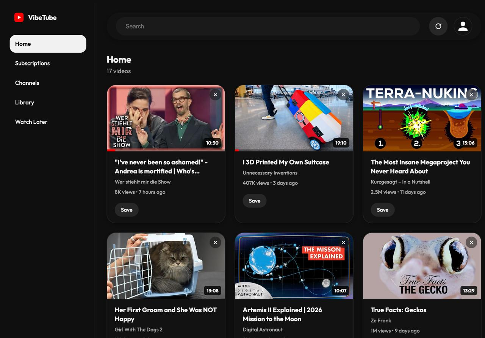

# VibeTube

VibeTube is a self-hosted web app for browsing and watching YouTube content.

> [!IMPORTANT]  
> Basically, it's a vibe coded Youtube Client Clone inspired by SmartTube and its features; built for personal use and local hosting. 



It includes:

- Home, Subscriptions, Channels, Library, Watch Later, and Search pages
- YouTube device-code sign-in
- Channel upload browsing
- Watch Later add/remove support
- Subtitle track support
- SponsorBlock segment lookup
- PWA support
- Docker Compose setup for local self-hosting

This project is not affiliated with YouTube or Google.

## Requirements

- Docker and Docker Compose
- Google OAuth credentials for a TV / Limited Input app
- A YouTube InnerTube API key provided through `YOUTUBE_INNERTUBE_API_KEY`

## Services

- `frontend`: nginx static frontend and PWA shell, exposed at `http://localhost:3000`
- `backend`: Kotlin / Spring Boot API, exposed at `http://localhost:8080`

## Quick Start

1. Copy the example environment file:

   ```sh
   cp .env.example .env
   ```

2. Fill in `.env`:

   ```sh
   YOUTUBE_OAUTH_CLIENT_ID=...
   YOUTUBE_OAUTH_CLIENT_SECRET=...
   YOUTUBE_INNERTUBE_API_KEY=...
   ```

3. Start the app from source:

   ```sh
   docker compose up -d --build
   ```

4. Open:

   ```text
   http://localhost:3000
   ```

## Run With Docker Compose Only

If you want to use the published images without cloning or building the source code, create a `docker-compose.yml` like this:

```yaml
name: vibetube

services:
  backend:
    image: ghcr.io/yazdipour/vibetube-backend:latest
    container_name: vibetube-backend
    environment:
      YOUTUBE_DATA_DIR: /data
      YOUTUBE_OAUTH_CLIENT_ID: ${YOUTUBE_OAUTH_CLIENT_ID}
      YOUTUBE_OAUTH_CLIENT_SECRET: ${YOUTUBE_OAUTH_CLIENT_SECRET}
      YOUTUBE_INNERTUBE_API_KEY: ${YOUTUBE_INNERTUBE_API_KEY}
    ports:
      - "8080:8080"
    volumes:
      - backend-data:/data
    networks:
      - vibetube

  frontend:
    image: ghcr.io/yazdipour/vibetube-frontend:latest
    container_name: vibetube-frontend
    depends_on:
      - backend
    ports:
      - "3000:80"
    networks:
      - vibetube

networks:
  vibetube:
    driver: bridge

volumes:
  backend-data:
```

Create a `.env` next to that Compose file:

```sh
YOUTUBE_OAUTH_CLIENT_ID=...
YOUTUBE_OAUTH_CLIENT_SECRET=...
YOUTUBE_INNERTUBE_API_KEY=...
```

Then start it:

```sh
docker compose up -d
```

Open:

```text
http://localhost:3000
```

## Development Checks

Frontend syntax:

```sh
node --check frontend/app.js
node --check frontend/sw.js
```

Backend tests, without requiring a local Gradle install:

```sh
docker compose up -d --build
# or
docker run --rm -v "$PWD/backend:/app" -w /app gradle:8.10.2-jdk17 gradle test --no-daemon
```

## Security Notes

- Never commit `.env` or OAuth secrets.
- YouTube session data is stored under the backend data directory, mounted as the `backend-data` Docker volume by default.
- Public deployments should be protected behind authentication or a private network.

## License

MIT. See [LICENSE](LICENSE).
